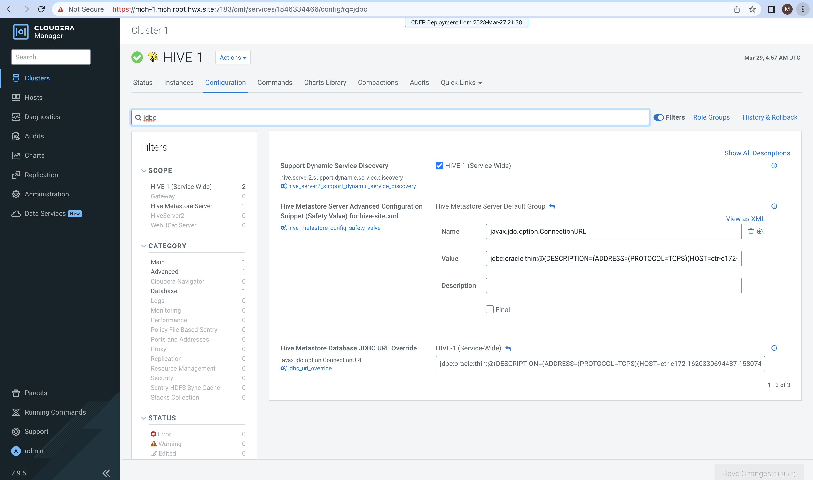
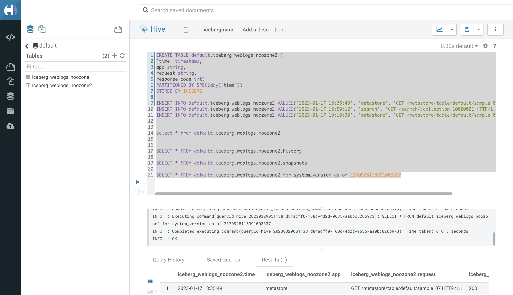

Video: https://youtu.be/qO0nES3uDd8

https://docs.google.com/document/d/1mKVX3r7Nsf8DN6LpusgAksEYf8lEES70kHfK5k4sHko/edit#


Create an Oracle auto-login wallet

```
orapki wallet create -wallet /opt/oracle/product/19c/dbhome_1/wallet -auto_login
```

Add a self signed certificate to this wallet

```
orapki wallet add -wallet /opt/oracle/product/19c/dbhome_1/wallet -dn "CN=server" -keysize 4096 -self_signed -validity 365
```

Export the certificate

```
orapki wallet export -wallet /opt/oracle/product/19c/dbhome_1/wallet -dn "CN=server" -cert server_ca.cert
```


```


cat /opt/oracle/product/19c/dbhome_1/network/admin/listener.ora

```
LISTENER =
  (DESCRIPTION_LIST =
    (DESCRIPTION =
      (ADDRESS = (PROTOCOL = TCP)(HOST = ctr-e172-1620330694487-1580740-01-000005.hwx.site)(PORT = 1521))
      (ADDRESS = (PROTOCOL = IPC)(KEY = EXTPROC1521))
      (ADDRESS = (PROTOCOL = TCPS)(HOST = ctr-e172-1620330694487-1580740-01-000005.hwx.site)(PORT = 2484))
    )
  )


SSL_CLIENT_AUTHENTICATION = FALSE

WALLET_LOCATION =
  (SOURCE =
    (METHOD = FILE)
    (METHOD_DATA =
      (DIRECTORY = /opt/oracle/product/19c/dbhome_1/wallet)
    )
  )


USE_SID_AS_SERVICE_listener=on
```

cat  /opt/oracle/product/19c/dbhome_1/network/admin/sqlnet.ora

```
DISABLE_OOB=on

NAMES.DIRECTORY_PATH= (TNSNAMES, ONAMES, HOSTNAME)

SSL_CLIENT_AUTHENTICATION = FALSE

WALLET_LOCATION =
  (SOURCE =
    (METHOD = FILE)
    (METHOD_DATA =
      (DIRECTORY = /opt/oracle/product/19c/dbhome_1/wallet)
    )
  )
```


cat /opt/oracle/product/19c/dbhome_1/network/admin/tnsnames.ora

```
ORCLCDB =
  (DESCRIPTION =
    (ADDRESS = (PROTOCOL = TCP)(HOST = ctr-e172-1620330694487-1580740-01-000005.hwx.site)(PORT = 1521))
    (CONNECT_DATA =
      (SERVER = DEDICATED)
      (SERVICE_NAME = ORCLCDB)
    )
  )

LISTENER_ORCLCDB =
  (ADDRESS = (PROTOCOL = TCP)(HOST = ctr-e172-1620330694487-1580740-01-000005.hwx.site)(PORT = 1521))


ORCLPDB1 =
    (DESCRIPTION =
      (ADDRESS = (PROTOCOL = TCP)(HOST = ctr-e172-1620330694487-1580740-01-000005.hwx.site)(PORT = 1521))
      (CONNECT_DATA =
        (SERVER = DEDICATED)
        (SERVICE_NAME = ORCLPDB1)
      )
    )


ORCLPDB1_SSL =
    (DESCRIPTION =
      (ADDRESS = (PROTOCOL = TCPS)(HOST = ctr-e172-1620330694487-1580740-01-000005.hwx.site)(PORT = 2484))
      (CONNECT_DATA =
        (SERVER = DEDICATED)
        (SERVICE_NAME = ORCLPDB2)
      )
      (SECURITY =
        (MY_WALLET_DIRECTORY = /opt/oracle/product/19c/dbhome_1/wallet)
      )
    )
```


Restart the listener

```
lsnrctl stop
lsnrctl start
```

Copy the content of exported certificate and add it to the keystore on the base cluster instances

Paste the copied content to ca-cert.pem.

Fetch keystore password from /etc/hadoop/conf/ssl-client.xml

```
/usr/java/default/bin/keytool -importcert -alias oracle -file ca-cert.pem -keystore /var/lib/cloudera-scm-agent/agent-cert/cm-auto-global_truststore.jks -storetype jks -noprompt -storepass <PASSWORD>
```
	
Add an override for the connection URL in CM -> HIVE-1 -> Configuration -> Hive Metastore Server Advanced Configuration Snippet (Safety Valve) for hive-site.xml

Name: javax.jdo.option.ConnectionURL

Value: 

```
jdbc:oracle:thin:@tcps://<BASE_CLUSTER_HOSTNAME>:2484/ORCLPDB1?javax.net.ssl.trustStore=/var/lib/cloudera-scm-agent/agent-cert/cm-auto-global_truststore.jks&javax.net.ssl.trustStorePassword=<PASSWORD>&oracle.net.ssl_server_dn_match=false
```
	
Change port to 2484 in CM -> HIVE-1 -> Configuration -> Hive Metastore Database Port

Restart the stale services (HIVE-1).


```
jdbc:oracle:thin:@(DESCRIPTION=(ADDRESS=(PROTOCOL=TCPS)(HOST=ctr-e172-1620330694487-1580740-01-000005.hwx.site)(PORT=2484))(CONNECT_DATA=(SERVER=DEDICATED)(SERVICE_NAME=ORCLPDB1))) 
```
	
	



```
ss -tulpn | grep 2484
tcp    LISTEN     0      128    [::]:2484               [::]:*                   users:(("tnslsnr",pid=15297,fd=13))
```

```
sudo -su oracle
cd
export ORACLE_HOME=/opt/oracle/product/19c/dbhome_1
export PATH=${PATH}:${ORACLE_HOME}/bin
sqlplus sys/cloudera@ORCLPDB1 as sysdba
```

https://github.com/marcredhat/150/blob/main/cdwicebergozone.md

```
CREATE TABLE default.iceberg_weblogs_noozone2 (
`time` timestamp,
app string,
request string,
response_code int)
PARTITIONED BY SPEC(day(`time`))
STORED BY ICEBERG

INSERT INTO default.iceberg_weblogs_noozone2 VALUES('2023-01-17 18:35:49', 'metastore', 'GET /metastore/table/default/sample_07 HTTP/1.1', 200);
INSERT INTO default.iceberg_weblogs_noozone2 VALUES('2023-01-17 18:50:12', 'search', 'GET /search/?collection=10000001 HTTP/1.1', 200);
INSERT INTO default.iceberg_weblogs_noozone2 VALUES('2023-01-17 19:10:30', 'metastore', 'GET /metastore/table/default/sample_07 HTTP/1.1', 200);


select * from default.iceberg_weblogs_noozone2


SELECT * FROM default.iceberg_weblogs_noozone2.history

SELECT * FROM default.iceberg_weblogs_noozone2.snapshots 

SELECT * FROM default.iceberg_weblogs_noozone2 for system_version as of 2370928115991003337
```





https://stackoverflow.com/questions/63928724/what-do-the-various-tables-in-hive-metastore-contain

https://analyticsanvil.wordpress.com/2016/08/21/useful-queries-for-the-hive-metastore/

https://github.com/marcredhat/150/blob/main/cdwicebergozone.md

```
Connected to:
Oracle Database 19c Enterprise Edition Release 19.0.0.0.0 - Production
Version 19.3.0.0.0

SQL> SELECT p.PDB_ID, p.PDB_NAME, t.OWNER, t.TABLE_NAME FROM DBA_PDBS p, CDB_TABLES t WHERE p.PDB_ID > 2 AND p.PDB_ID = t.CON_ID and table_name like '%METASTORE%';

    PDB_ID
----------
PDB_NAME
--------------------------------------------------------------------------------
OWNER
--------------------------------------------------------------------------------
TABLE_NAME
--------------------------------------------------------------------------------
	 3
ORCLPDB1
HIVE1
METASTORE_DB_PROPERTIES
```


```
SELECT p.PDB_ID, p.PDB_NAME, t.OWNER, t.TABLE_NAME FROM DBA_PDBS p, CDB_TABLES t WHERE p.PDB_ID > 2 AND p.PDB_ID = t.CON_ID and table_name like '%TBL%'
```

```
SELECT t.* FROM hive1.TBLS t JOIN hive1.DBS d ON t.DB_ID = d.DB_ID WHERE d.NAME = 'default' and t.TBL_NAME  LIKE '%iceberg%';
```

https://docs.google.com/document/d/1x4AH7_A7z1C9oZJndFHOeinDuZIHxIFVnpsJ0wZhnEg/edit
